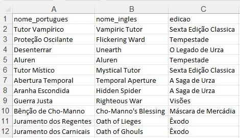
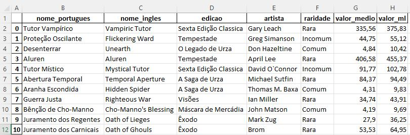

# Magic Preço Médio
## Descrição do projeto
Projeto de mineração de dados (web scraping), para extração do preço médio das cartas do jogo Magic no site ligamagic.com. Para posteriormente compor o preço de venda no Mercado Livre. 

## Funcionalidades do projeto

- `Funcionalidade 1`: captura do preço médio no site ligamagic.com
- `Funcionalidade 2`: cálculo do percentual da comissão do Mercado Livre
- `Funcionalidade 3`: geração da planilha Excel de saída com as colunas: nome em português, nome em inglês, edição, artista, raridade, valor médio, valor do mercado livre.

## Aplicação

## Ferramentas utilizadas
- `Python`
- `Selenium`

## Acesso ao projeto

Você pode acessar o [código fonte do projeto](https://github.com/alan-vieira/preco_magic_card/blob/master/lista_magic_preco.py) ou [baixá-lo](https://github.com/alan-vieira/preco_magic_card/archive/refs/heads/master.zip).

## Abrir e rodar o projeto
Após baixado, para o funcionamento correto da aplicação as seguintes dependêcias deverão ser instaladas.

- `pandas`
- `selenium`
- `webdriver-manager`
- `webDriver`
- `ActionChains`
- `By`
- `NoSuchElementException`
- `openpyxl`

Obs.: Com a intalação do webdriver-manager o arquivo chromedriver passa a ser instalado de forma altonoma, sem a necessidade de verificação da versão do navegador.

Para rodar o projeto, depois das instalações necessárias, precisamos criar e colocar na pasta excel (também deverá ser criada) o aquivo lista_cartas_magic_com_edicao.xlsx que contém o seguinte formato.

E após a execução do programa o seguinte arquivo excel (saída) devera ser aguardo da mesma pasta.

## Autor

| [ Alan Vieira](https://github.com/alan-vieira) |
| :---: |
