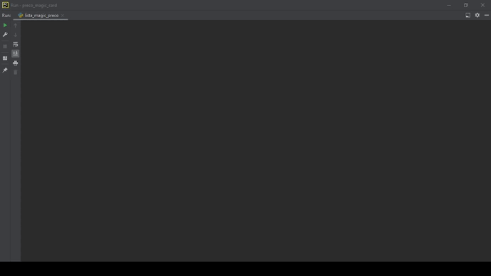

# 🃏 Magic Preço Médio: Automação de Precificação & Scraping

## 📖 Visão Geral

Este projeto é uma solução de Inteligência de Mercado voltada para o setor de colecionáveis. Ele automatiza a coleta de preços médios de cartas de Magic: The Gathering no site LigaMagic e processa esses dados para gerar uma estratégia de precificação competitiva no Mercado Livre, considerando automaticamente as taxas de comissão da plataforma.

## 🚀 Funcionalidades Chave

- **Extração Dinâmica (Scraping)**: Navegação automatizada e mineração de dados em tempo real utilizando Selenium.

- **Inteligência de Precificação**: Cálculo customizado de margens de lucro e taxas de marketplace (Mercado Livre).

- **Pipeline de Dados**: Ingestão de lista de entrada (.xlsx) e exportação de relatório consolidado com dados de edição, artista, raridade e valores sugeridos.

## 📂 Fluxo de Trabalho

1. **Entrada**: O sistema lê um arquivo Excel (lista_cartas_magic_com_edicao.xlsx) contendo o nome das cartas.

2. **Processamento**: - O Selenium realiza a busca no LigaMagic.

  - Captura o menor e o médio preço.

  - Aplica a lógica de comissão do Mercado Livre.

3. **Saída**: Gera um novo Excel detalhado, pronto para upload ou consulta de estoque.

## 🔧 Configuração e Uso

1. Clone o repositório:

```
git clone https://github.com/alan-vieira/preco_magic_card.git
```
2. Instale as dependências:

```
pip install -r requirements.txt
```
3. Certifique-se de que a pasta `excel/` contenha o arquivo de entrada no formato correto.

4. Execute o script principal:

```
python magic_preco_medio.py
```

## 📺 Demonstração (GIF)



**Alan Vieira** - *Engenheiro de Telecomunicações & Especialista em Dados*

- [LinkedIn](https://www.linkedin.com/in/alansilvavieira)

- [GitHub Portfólio](https://github.com/alan-vieira)
